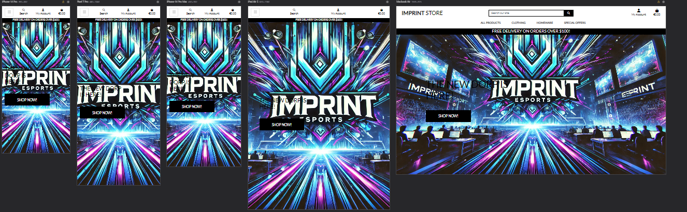
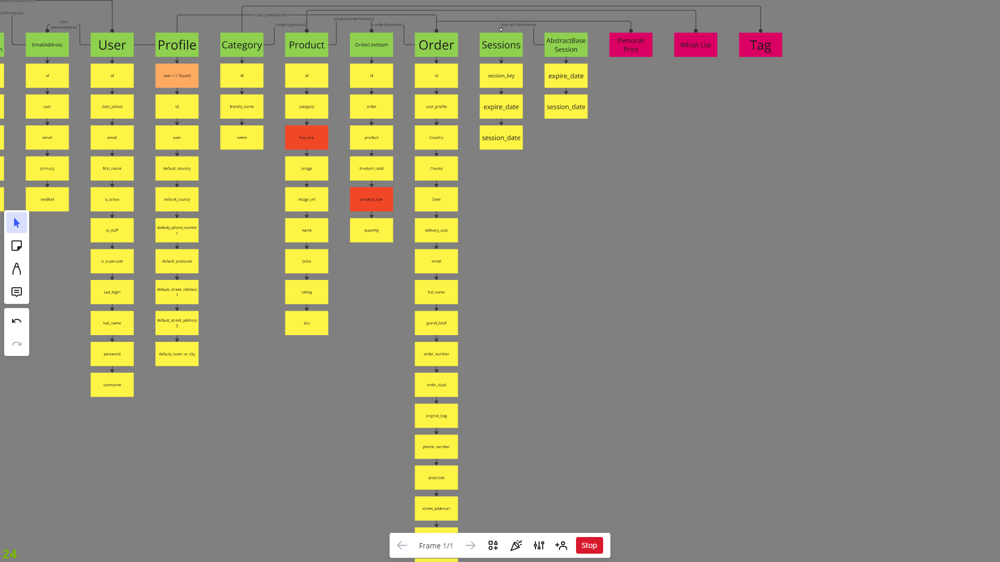
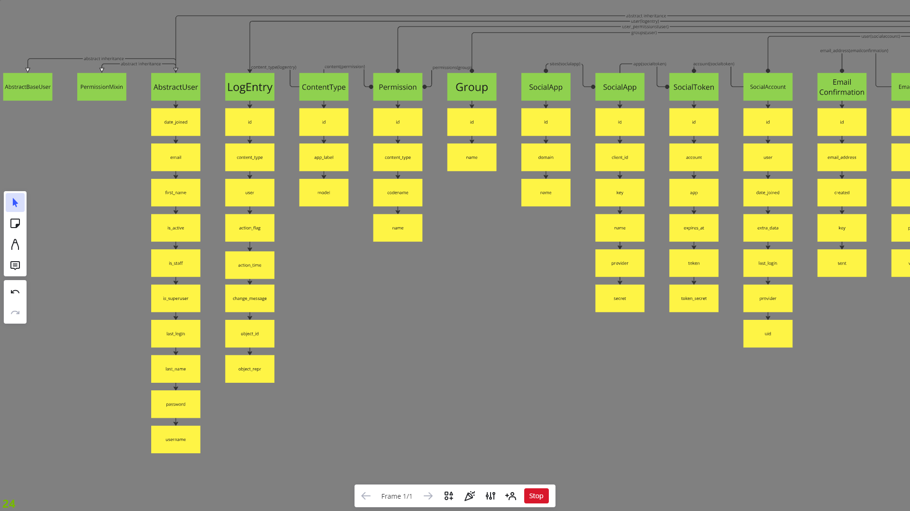
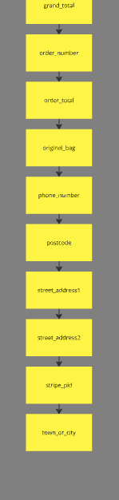
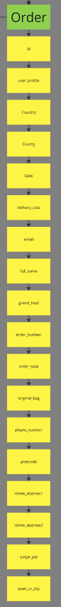

# Imprint Esports

Imprint Esports is a gaming analytics company striving to produce the best visual indicators for professional player performance to team organizations, showing how their players are performing at the highest level of competition.

---
This [site](https://imprint-store-3d6ba50a85bd.herokuapp.com/) is a merchandise store for the Imprint Brand to promote the service and to produce revenue for the company.

## Contents

- [Imprint Esports](#imprint-esports)
  - [Contents](#contents)
  - [Agile](#agile)
    - [Target Audience](#target-audience)
    - [User Stories](#user-stories)
      - [New Visitor Goals](#new-visitor-goals)
      - [Returning Visitor Goals](#returning-visitor-goals)
      - [Admin Goals](#admin-goals)
  - [SEO Strategy for Imprint Esports Store](#seo-strategy-for-imprint-esports-store)
  - [Business Model for Imprint Esports Store](#business-model-for-imprint-esports-store)
    - [Revenue Streams](#revenue-streams)
    - [Cost Structure](#cost-structure)
    - [Customer Relationships](#customer-relationships)
    - [Key Channels](#key-channels)
    - [Value Proposition](#value-proposition)
  - [Features](#features)
    - [Existing Features](#existing-features)
    - [Features Left to Implement](#features-left-to-implement)
  - [Testing](#testing)
  - [ERD](#erd)
  - [Deployment](#deployment)
    - [Deployment Steps](#deployment-steps)
  - [Technologies Used](#technologies-used)
    - [Languages](#languages)
    - [Frameworks, Libraries \& Tools](#frameworks-libraries--tools)
  - [Credits](#credits)
  - [Acknowledgements](#acknowledgements)

---

## Agile

[Kanban Board](https://github.com/users/Mulloo/projects/4)

### Target Audience

- Esports enthusiasts and fans of **Imprint Esports**.
- Gamers looking for branded merchandise such as apparel and gaming gear.
- Users looking for an intuitive, mobile-responsive online shopping experience.

### User Stories

#### New Visitor Goals

- As a user, I want to easily navigate through product categories and find merchandise.
- As a user, I want to be able to create an account and log in quickly.
- As a user, I want to add items to my wishlist for future purchases.
- As a user, I want to receive order confirmations via email after making a purchase.

#### Returning Visitor Goals

- As a user, I want to view my past orders and track my order history.
- As a user, I want to easily manage my account details and preferences.
- As a user, I want to leave reviews and ratings for purchased products.

#### Admin Goals

- As a site admin, I want to manage products and categories easily through the admin interface.
- As a site admin, I want to be able to monitor user activity, orders, and payments.

## SEO Strategy for Imprint Esports Store

1. **Keyword Optimization**:
   - Target keywords like "Esports Merchandise," "Imprint Esports Gear," "Gaming Apparel," and "Esports Accessories."
   - Optimize product descriptions, meta titles, headers, and alt tags.

2. **Content Marketing**:
   - Create blogs related to esports, gaming trends, and merchandise launches to drive organic traffic.

3. **Technical SEO**:
   - Improve mobile performance, reduce page load times, and use clean URLs.

4. **Backlinking**:
   - Partner with esports influencers and related blogs for backlinks.

5. **Social Media Integration**:
   - Use Twitch, YouTube, and Instagram to boost engagement and drive store traffic.

---

## Business Model for Imprint Esports Store

### Revenue Streams

1. **Product Sales**:
   - Revenue primarily from selling esports-branded merchandise like clothing, accessories, and gaming gear.

2. **Limited Editions**:
   - Offer exclusive, limited-time collections to drive urgency and boost sales.

3. **Partnerships & Sponsorships**:
   - Collaborate with gaming brands and influencers for co-branded products.

4. **Affiliate Marketing**:
   - Partner with influencers for affiliate-based sales with commissions.

### Cost Structure

1. **Manufacturing**:
   - Costs of product creation, bulk orders, and quality control.

2. **Shipping & Logistics**:
   - Domestic and international shipping management.

3. **Marketing**:
   - Paid ads, influencer collaborations, and SEO optimization expenses.

4. **Platform Maintenance**:
   - Costs for hosting, payment gateways, security, and platform updates.

### Customer Relationships

1. **Community Engagement**:
   - Build relationships through social media, esports events, and fan-based content.

2. **Customer Support**:
   - Provide customer service via email, live chat, and social media.

3. **Loyalty Programs**:
   - Offer a rewards system for repeat customers, with perks like discounts and free shipping.

### Key Channels

1. **Website**:
   - The primary sales platform for the store.

2. **Social Media**:
   - Engage fans on Twitch, Twitter, Instagram, and YouTube to promote the store.

3. **Email Marketing**:
   - Use newsletters for promotions, new product launches, and sales.

### Value Proposition

- Offer high-quality, exclusive esports merchandise with a focus on brand loyalty, limited-edition collections, and a user-friendly shopping experience.

---

## Features

---

### Existing Features

1. **User Authentication:**
   - Users can register, log in, and manage their accounts.
   - Integrated with Django Allauth for social logins.

2. **Product Management:**
   - Users can browse and search for products by category.
   - Product details include images, prices, and stock availability.

3. **Wishlist:**
   - Users can add products to their wishlist for future reference.
   - Wishlist items are stored uniquely per user.

4. **Shopping Cart & Checkout:**
   - Users can add products to their shopping cart and proceed to checkout.
   - Stripe is used for secure payment processing.
   - Users receive email confirmations for successful orders.

5. **Order History:**
   - Logged-in users can view their previous orders and order details.

6. **Admin Interface:**
   - Admins can add, edit, and delete products and categories through the Django admin panel.
   - Order management allows for monitoring payments and shipping.

### Features Left to Implement

- **Reviews & Ratings:** Users will be able to leave reviews and rate products.
- **Product Recommendations:** Users will receive personalized product recommendations based on their purchase history.

---

## Testing

- **Browser Compatibility**: Tested on multiple browsers including Chrome, Firefox, and Safari.
- **Responsiveness**: Verified across different devices (mobile, tablet, and desktop) using Chrome Developer Tools and responsive viewer 
- **Functionality**: All forms (registration, login, checkout) were tested for expected behavior.
- **Payment Testing**: Stripe’s test environment was used for validating the checkout and payment process.
- **Bug Fixes**: List of bugs found and resolved during development. For example:
  - **Bug 1**: Issue with email confirmation not being sent (resolved by configuring email backend).
  - **Bug 2**: Display issues on smaller screen sizes (resolved by adjusting Bootstrap classes).

---

## ERD

---

## Deployment

The project was deployed using **Heroku** and **AWS S3** for static file storage. Below are the steps taken to deploy:

### Deployment Steps

1. **Set up a new Heroku app** and link to the GitHub repository.
2. **Add PostgreSQL database** and configure environment variables for production.
3. **Configure AWS S3** for static and media file storage.
4. **Set environment variables** such as `SECRET_KEY`, `DATABASE_URL`, and `STRIPE_API_KEYS`.
5. **Run migrations** and collect static files using `python manage.py migrate` and `python manage.py collectstatic`.
6. **Deploy the app** via Heroku’s GitHub integration and automated deployment pipeline.

---

## Technologies Used

### Languages

- **HTML5**
- **CSS3**
- **JavaScript**
- **Python** (Django Framework)

### Frameworks, Libraries & Tools

- **Django**: Web framework for building the backend and admin functionalities.
- **Bootstrap 5**: Frontend framework for responsive design.
- **Stripe**: Payment processing.
- **PostgreSQL**: Database for handling product and order data.
- **AWS S3**: Storage for static and media files.
- **Django Allauth**: User authentication and management.
- **Crispy Forms**: For enhanced form styling.
- **Heroku**: Platform for deployment.
- **Git**: Version control.
- **GitHub**: Repository hosting.

---

## Credits

I do not own Imprint Esports and all credit for the brand and company goes to its founders.

---

## Acknowledgements

A massive thank you to the Imprint founders fo the permission to use the brand and its likeness for this site.

[Imprint Esports Socials](https://linktr.ee/imprintesports)

Imprint Founders

- [Adam Farrell](https://www.linkedin.com/in/adampfarrell/)
- [Liam Junkermann](https://www.linkedin.com/in/liamjunkermann/)
- [Peadar Kenny](https://www.linkedin.com/in/peadarkenny/)

---
