# Imprint Store


**Developer: [ Daniel Mullooly aka Mulloo ]**

[](https://imprint-store-3d6ba50a85bd.herokuapp.com/)
[](https://github.com/Mulloo/imprint_store)

[](https://djangoproject.com/)
[](https://python.org/)

## Table of Contents

- [About](#about)
  - [User Experience](#user-experience)
  - [User Stories](#user-stories)
  - [Design](#design)
  - [Agile Methodology](#agile-methodology)
  - [Data Model](#data-model)
  - [Testing](#testing)
  - [Security Features and Defensive Design](#security-features-and-defensive-design)
  - [Features](#features)
  - [Code Quality and Validation](#code-quality-and-validation)
  - [Technologies Used](#technologies-used)
  - [Deployment](#deployment)
  - [Bugs and Issues](#bugs-and-issues)
  - [Credits](#credits)
  - [Acknowledgements](#acknowledgements)

---

## About

Imprint Store is a full-stack e-commerce web application built for the Imprint Esports brand. Imprint Esports is a gaming analytics company that provides visual performance indicators for professional esports teams, helping organizations track their players' performance at the highest level of competition.

This online merchandise store serves to promote the Imprint brand while generating revenue through the sale of high-quality branded merchandise including apparel, gaming peripherals, and accessories. The platform delivers a seamless shopping experience with modern web technologies and secure payment processing.

---

## User Experience

### Target Audience

- Esports enthusiasts and fans of competitive gaming
- Supporters of the Imprint Esports brand
- Gamers seeking high-quality branded merchandise
- Users looking for gaming apparel and accessories
- Mobile and desktop users requiring responsive e-commerce functionality

### User Requirements and Expectations

- Intuitive and responsive navigation across all devices
- Comprehensive product browsing with search and filtering capabilities
- Secure user authentication and account management
- Reliable shopping cart and checkout process with multiple payment options
- Order tracking and history functionality
- Professional design reflecting the esports brand identity
- Fast loading times and optimal performance
- Clear product information with high-quality images

---

## User Stories

### Epic 1: User Account Management

- As a **new user**, I can **register for an account** so that **I can access personalized features**
- As a **registered user**, I can **log in and log out** so that **I can securely access my account**
- As a **user**, I can **reset my password** so that **I can regain access to my account**
- As a **user**, I can **update my profile information** so that **my details are current**
- As a **user**, I can **view my order history** so that **I can track my purchases**

### Epic 2: Product Browsing and Search

- As a **shopper**, I can **view all products** so that **I can browse the available merchandise**
- As a **shopper**, I can **search for products** so that **I can find specific items**
- As a **shopper**, I can **filter products by category** so that **I can narrow down my options**
- As a **shopper**, I can **sort products by price, rating, or name** so that **I can organize my browsing**
- As a **shopper**, I can **view detailed product information** so that **I can make informed purchases**

### Epic 3: Shopping Cart and Checkout

- As a **shopper**, I can **add products to my shopping bag** so that **I can purchase multiple items**
- As a **shopper**, I can **modify quantities in my bag** so that **I can adjust my order**
- As a **shopper**, I can **remove items from my bag** so that **I can change my mind about purchases**
- As a **shopper**, I can **securely checkout** so that **I can complete my purchase**
- As a **shopper**, I can **receive order confirmation** so that **I know my purchase was successful**

### Epic 4: Wishlist Management

- As a **registered user**, I can **add products to my wishlist** so that **I can save items for later**
- As a **registered user**, I can **remove products from my wishlist** so that **I can manage my saved items**
- As a **registered user**, I can **view my wishlist** so that **I can see all my saved products**

### Epic 5: Product Reviews

- As a **registered user**, I can **leave reviews for products** so that **I can share my experience**
- As a **registered user**, I can **rate products** so that **I can provide feedback**
- As a **shopper**, I can **read product reviews** so that **I can make informed decisions**

### Epic 6: Site Administration

- As a **store owner**, I can **add new products** so that **I can expand the catalog**
- As a **store owner**, I can **edit product details** so that **I can keep information current**
- As a **store owner**, I can **delete products** so that **I can remove discontinued items**
- As a **store owner**, I can **manage orders** so that **I can process customer purchases**

---

## Design

### Color Scheme

The design follows a professional esports-inspired color palette:

### Color Palette

- **Primary**: #000000 (Black) - Strong, professional
- **Secondary**: #FFFFFF (White) - Clean, modern
- **Accent**: #007BFF (Blue) - Trust, technology
- **Success**: #28A745 (Green) - Positive actions
- **Warning**: #FFC107 (Yellow) - Alerts
- **Danger**: #DC3545 (Red) - Errors

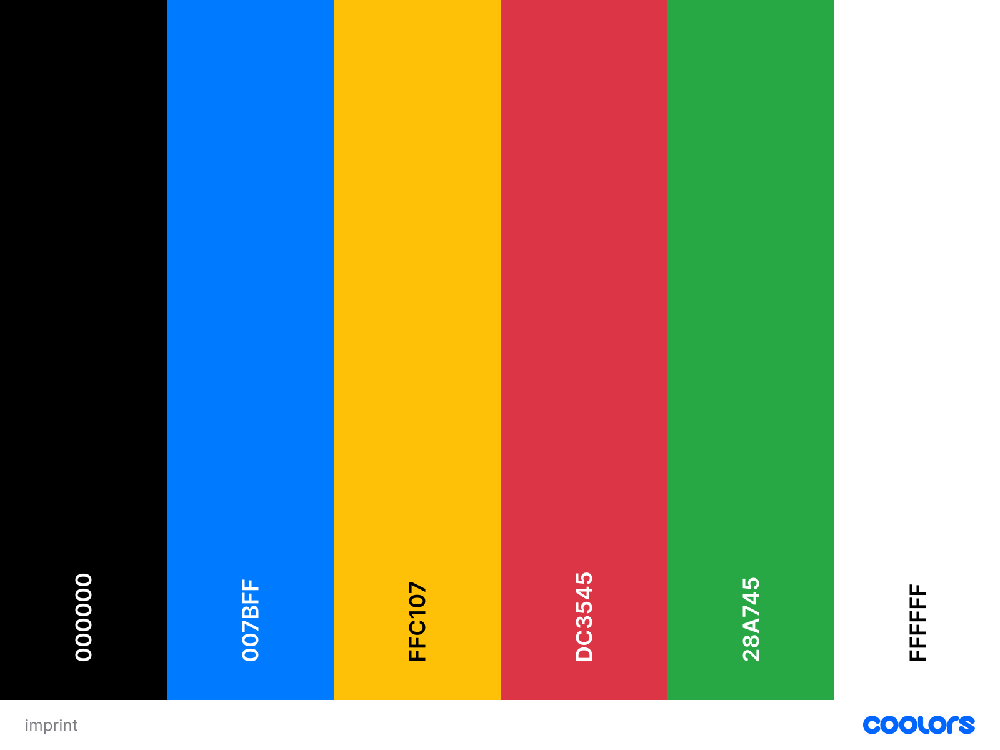

### Typography

- **Primary Font**: Modern, clean sans-serif fonts for optimal readability
- **Headings**: Bold weights for clear hierarchy
- **Body Text**: Regular weights for comfortable reading experience
- **Buttons and CTAs**: Medium weights for clear action items

### Layout and Structure

- **Mobile-First Design**: Responsive layout optimized for mobile devices
- **Grid System**: Bootstrap 4 grid for consistent spacing and alignment
- **Navigation**: Fixed header with collapsible mobile menu
- **Footer**: Organized links and contact information
- **Cards**: Consistent product card design across the site

### Imagery

- **Product Images**: High-quality mockup images for merchandise
- **Brand Logo**: Prominent Imprint Esports branding
- **Icons**: Font Awesome icons for intuitive user interface
- **Background**: Clean, minimal backgrounds to highlight products

### Wireframes and UX Design

The application was designed with a mobile-first approach using wireframes to establish the user experience flow. The wireframes document the basic layout and user interactions for all key pages.

**Wireframe's Documentation**:

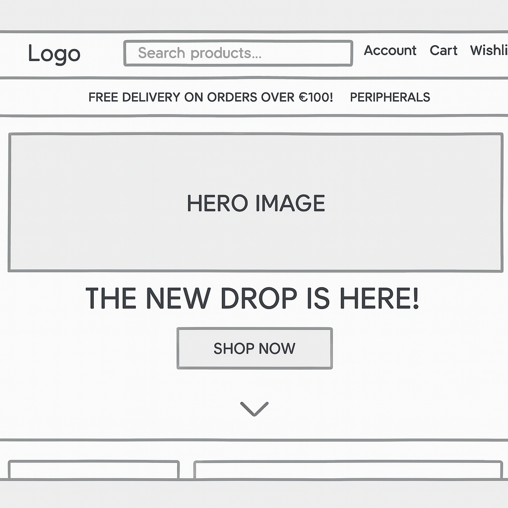

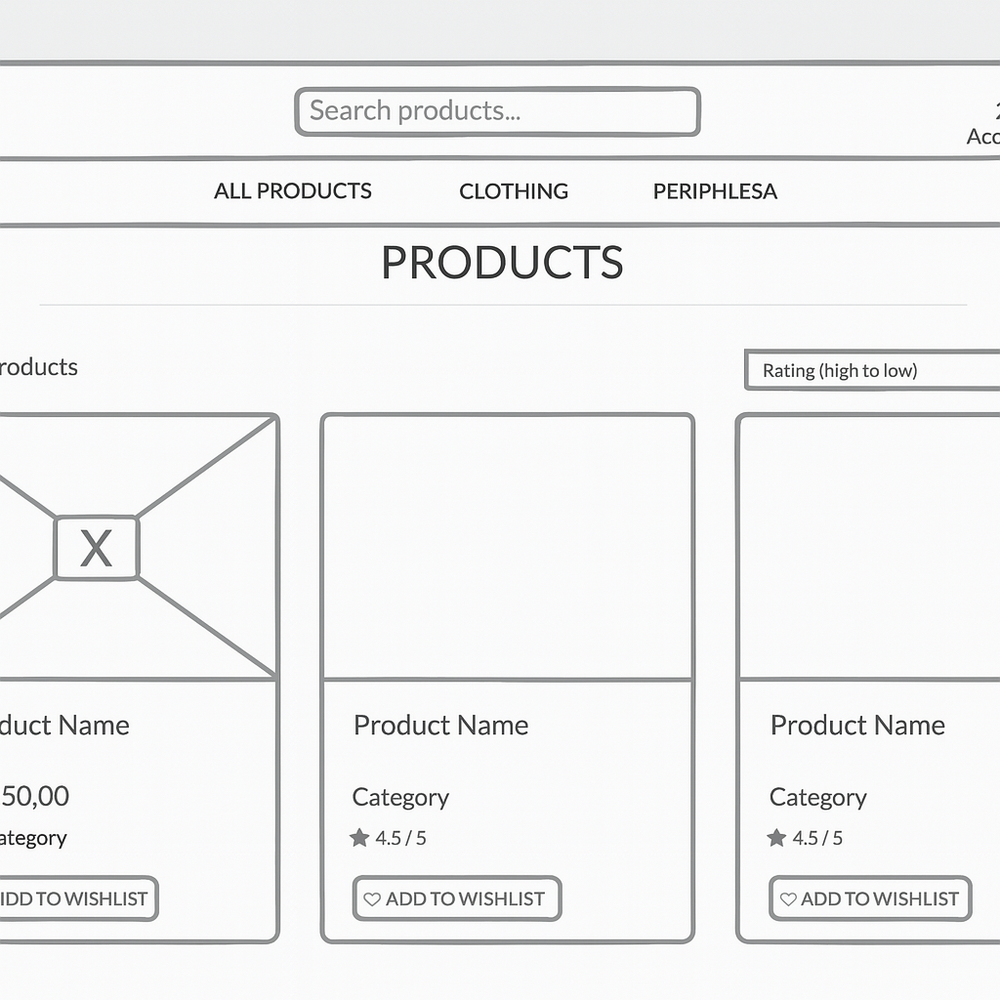

Key design decisions:

- Clean, minimal layout focusing on product presentation
- Consistent navigation across all device sizes
- Intuitive shopping cart and checkout flow
- Accessible design with high contrast and clear typography
- Mobile-optimized touch targets and interactions

---

## Agile Methodology

This project was developed using Agile methodology with the following approach:

### Project Management

- **GitHub Projects**: Used for project planning and tracking
- **Kanban Board**: [View Project Board](https://github.com/users/Mulloo/projects/4)
- **User Stories**: Each feature developed based on user requirements
- **Iterative Development**: Features developed and tested in sprints

### Development Process

1. **Planning**: User stories created and prioritized
2. **Development**: Features built incrementally
3. **Testing**: Continuous testing throughout development
4. **Review**: Regular review and adjustment of priorities
5. **Deployment**: Staged deployment with testing

---

## Data Model

### Entity Relationship Diagram

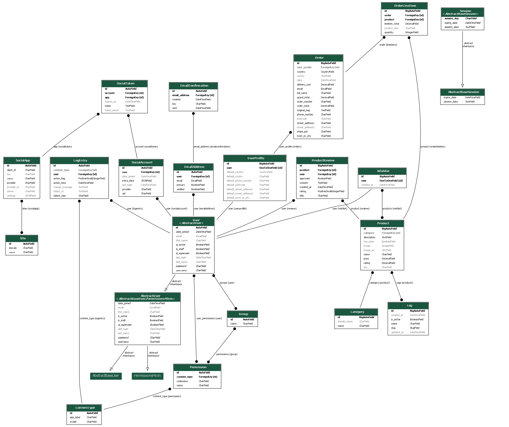

### Core Models

#### User Model (Django Built-in)

- Handles user authentication and basic user information
- Extended by UserProfile model for additional data

#### UserProfile Model

```python
class UserProfile(models.Model):
    user = models.OneToOneField(User, on_delete=models.CASCADE)
    default_phone_number = models.CharField(max_length=20, null=True, blank=True)
    default_street_address1 = models.CharField(max_length=80, null=True, blank=True)
    default_street_address2 = models.CharField(max_length=80, null=True, blank=True)
    default_town_or_city = models.CharField(max_length=40, null=True, blank=True)
    default_county = models.CharField(max_length=80, null=True, blank=True)
    default_postcode = models.CharField(max_length=20, null=True, blank=True)
    default_country = CountryField(blank_label='Country', null=True, blank=True)
```

#### Product Model

```python
class Product(models.Model):
    category = models.ForeignKey('Category', null=True, blank=True, on_delete=models.SET_NULL)
    sku = models.CharField(max_length=254, null=True, blank=True)
    name = models.CharField(max_length=254)
    description = models.TextField()
    has_sizes = models.BooleanField(default=False, null=True, blank=True)
    price = models.DecimalField(max_digits=6, decimal_places=2)
    rating = models.DecimalField(max_digits=6, decimal_places=2, null=True, blank=True)
    image_url = models.URLField(max_length=1024, null=True, blank=True)
    image = models.ImageField(null=True, blank=True)
    tags = models.ManyToManyField('Tag', blank=True)
```

#### Category Model

```python
class Category(models.Model):
    name = models.CharField(max_length=254)
    friendly_name = models.CharField(max_length=254, null=True, blank=True)
```

#### Tag Model (Custom)

```python
class Tag(models.Model):
    name = models.CharField(max_length=100, unique=True)
    slug = models.SlugField(max_length=100, unique=True)
    is_active = models.BooleanField(default=True)
```

#### Order Model

```python
class Order(models.Model):
    order_number = models.CharField(max_length=32, null=False, editable=False)
    user_profile = models.ForeignKey(UserProfile, on_delete=models.SET_NULL, null=True, blank=True, related_name='orders')
    full_name = models.CharField(max_length=50, null=False, blank=False)
    email = models.EmailField(max_length=254, null=False, blank=False)
    phone_number = models.CharField(max_length=20, null=False, blank=False)
    country = CountryField(blank_label='Country *', null=False, blank=False)
    postcode = models.CharField(max_length=20, null=True, blank=True)
    town_or_city = models.CharField(max_length=40, null=False, blank=False)
    street_address1 = models.CharField(max_length=80, null=False, blank=False)
    street_address2 = models.CharField(max_length=80, null=True, blank=True)
    county = models.CharField(max_length=80, null=True, blank=True)
    date = models.DateTimeField(auto_now_add=True)
    delivery_cost = models.DecimalField(max_digits=6, decimal_places=2, null=False, default=0)
    order_total = models.DecimalField(max_digits=10, decimal_places=2, null=False, default=0)
    grand_total = models.DecimalField(max_digits=10, decimal_places=2, null=False, default=0)
    original_bag = models.TextField(null=False, blank=False, default='')
    stripe_pid = models.CharField(max_length=254, null=False, blank=False, default='')
```

#### Wishlist Model (Custom)

```python
class Wishlist(models.Model):
    user = models.ForeignKey(User, on_delete=models.CASCADE)
    product = models.ForeignKey(Product, on_delete=models.CASCADE)
    added_date = models.DateTimeField(auto_now_add=True)
```

#### ProductReview Model (Custom)

```python
class ProductReview(models.Model):
    RATING_CHOICES = [
        (1, '1 Star'),
        (2, '2 Stars'),
        (3, '3 Stars'),
        (4, '4 Stars'),
        (5, '5 Stars'),
    ]
    
    product = models.ForeignKey(Product, on_delete=models.CASCADE, related_name='reviews')
    user = models.ForeignKey(User, on_delete=models.CASCADE)
    rating = models.IntegerField(choices=RATING_CHOICES)
    title = models.CharField(max_length=200)
    comment = models.TextField()
    created_date = models.DateTimeField(auto_now_add=True)
    approved = models.BooleanField(default=True)
```

---

## Testing

Comprehensive testing was conducted throughout the development process to ensure functionality, usability, and performance.

### Testing Approach

- **Manual Testing**: Systematic testing of all user journeys
- **User Acceptance Testing**: Real users tested the application
- **Browser Compatibility**: Testing across multiple browsers
- **Responsive Testing**: Verification on various devices
- **Payment Testing**: Stripe test environment validation

### Test Results Summary

- All user authentication flows working correctly
- Product browsing and search functionality verified
- Shopping cart and checkout process tested
- Wishlist management functioning properly
- Review system operational
- Admin functionality working as expected
- Payment processing through Stripe successful
- Email confirmations sending correctly
- Responsive design verified on all device sizes

For detailed testing documentation, see [TEST.md](TEST.MD)

---

## Security Features and Defensive Design

### Authentication Security

- **Django Allauth**: Secure user authentication system
- **Password Hashing**: PBKDF2 password hashing with salt
- **Email Verification**: Account activation via email confirmation
- **Session Management**: Secure session handling with configurable timeouts

### Data Protection

- **CSRF Protection**: Cross-Site Request Forgery protection on all forms
- **SQL Injection Prevention**: Django ORM parameterized queries
- **XSS Prevention**: Template auto-escaping and input sanitization
- **Secure Headers**: HTTP security headers via Django middleware

### Payment Security

- **PCI Compliance**: Stripe handles all sensitive payment data
- **SSL Encryption**: HTTPS enforced for all transactions
- **Webhook Verification**: Stripe webhook signature validation
- **No Card Storage**: Payment information never stored locally

### Environment Security

- **Environment Variables**: Sensitive data stored in environment variables
- **Debug Settings**: Debug mode disabled in production
- **Database Security**: Production database with restricted access
- **AWS S3**: Secure cloud storage for static and media files

---

## Features

### Existing Features

- *Note: CSS styles have changed since the images were collected*

#### User Authentication System

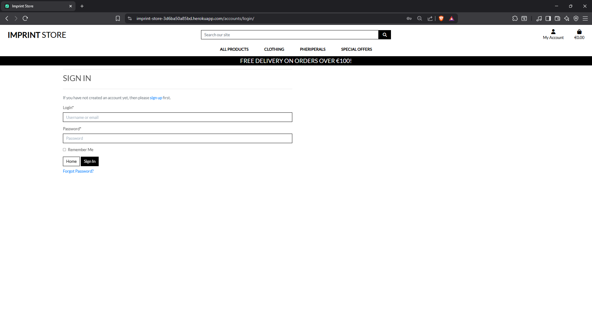
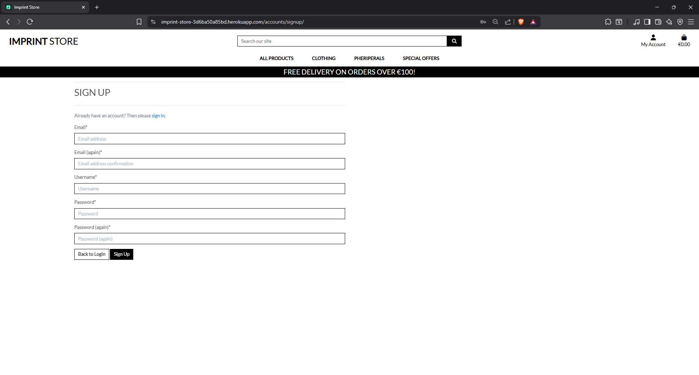

- User registration with email verification
- Secure login/logout functionality
- Password reset capability
- User profile management
- Order history tracking

#### Product Catalog

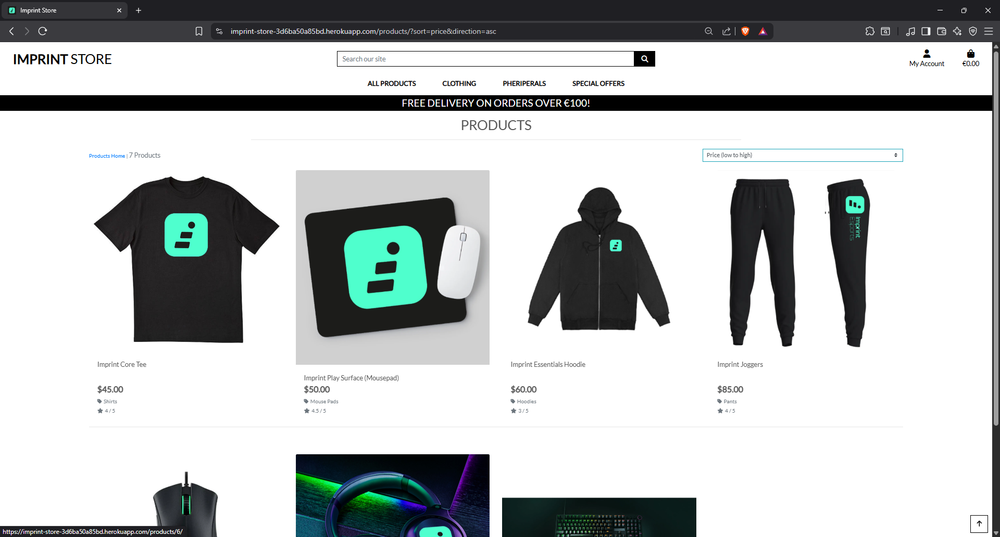

- Comprehensive product listings with pagination
- Product search functionality
- Category-based filtering
- Product sorting by price, rating, and name
- Tag-based product discovery

#### Product Detail Pages

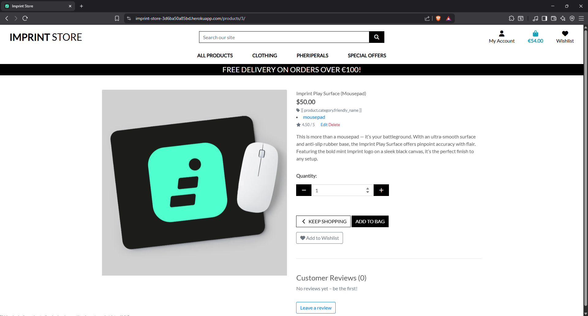

- Detailed product information and images
- Customer reviews and ratings
- Add to cart and wishlist functionality
- Size selection where applicable
- Related product suggestions

#### Shopping Cart System

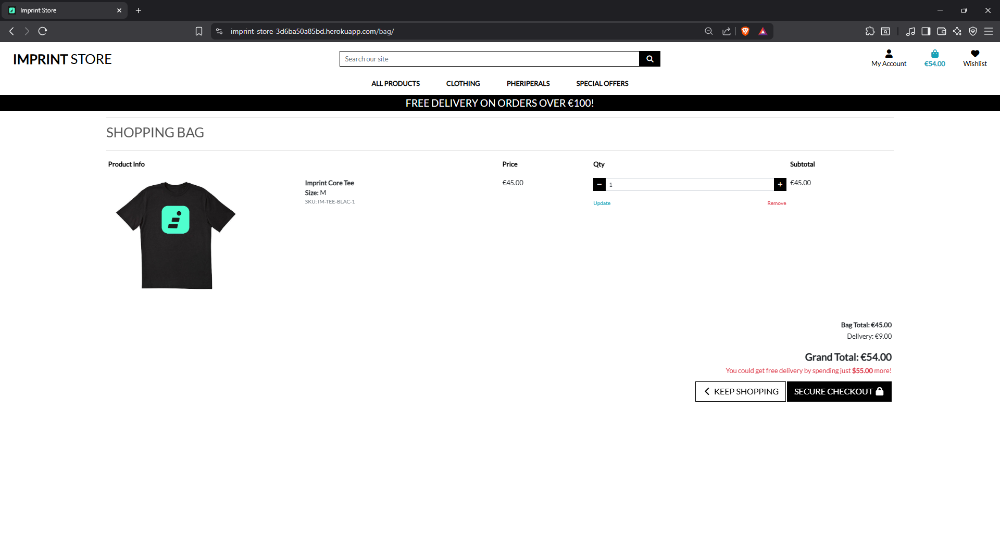
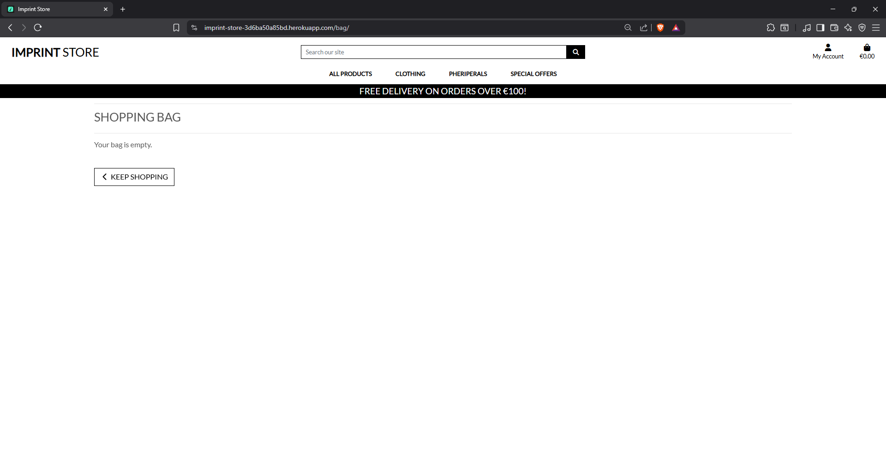

- Session-based shopping cart
- Quantity adjustment capabilities
- Real-time price calculations
- Delivery cost calculations
- Free delivery threshold notifications

#### Secure Checkout Process

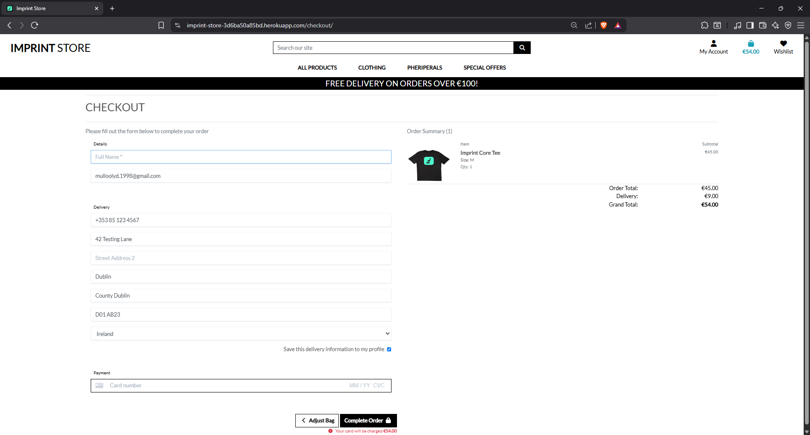

- Stripe payment integration
- Order summary and confirmation
- Delivery information management
- Email confirmation system
- Guest and registered user checkout

#### Wishlist Management

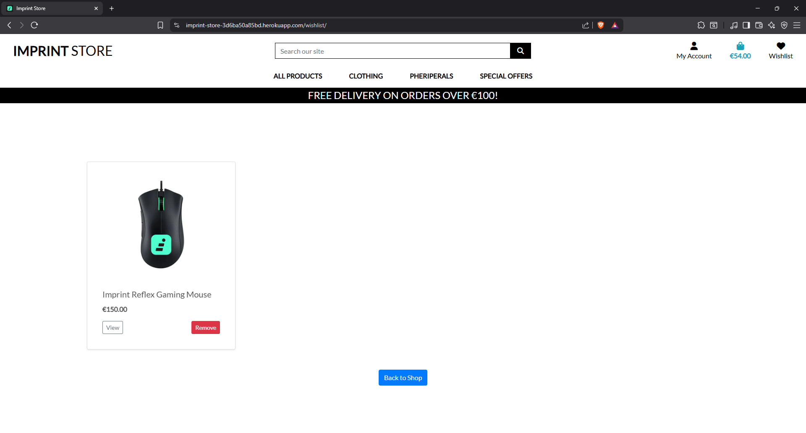
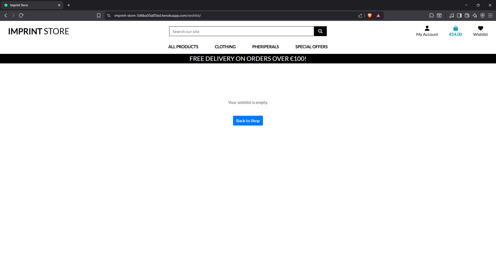

- Personal product wishlist for registered users
- Easy add/remove functionality
- Wishlist persistence across sessions
- Quick access from product pages

#### Review System

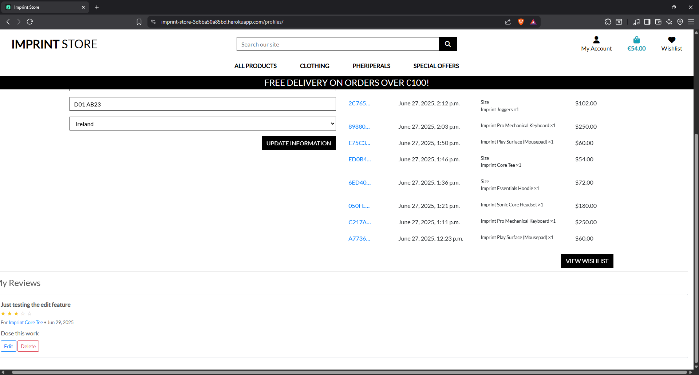
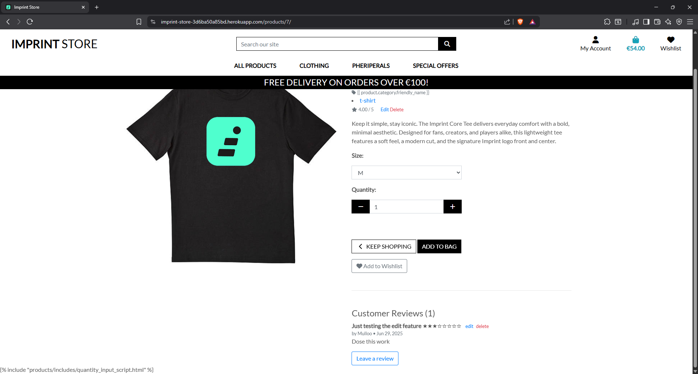

- Product review and rating system
- User-generated content moderation
- Review editing and deletion
- Review display with user information

#### Admin Interface

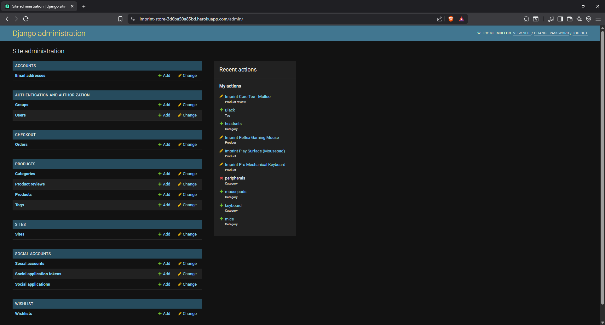

- Django admin panel for product management
- Order monitoring and management
- User management capabilities
- Category and tag administration

#### Responsive Design

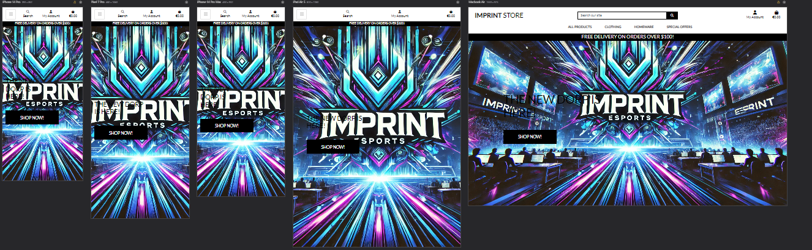

- Mobile-first responsive design
- Cross-browser compatibility
- Optimized for all device sizes
- Touch-friendly interface elements

### Features Left to Implement

#### Advanced Functionality

- **Inventory Management**: Stock tracking and low-stock alerts
- **Advanced Product Recommendations**: AI-based suggestion engine
- **Live Chat Support**: Real-time customer service integration
- **Multi-language Support**: Internationalization capabilities

#### Enhanced User Experience

- **Product Comparison**: Side-by-side product comparison tool
- **Advanced Search Filters**: More granular filtering options
- **Social Media Integration**: Enhanced social sharing capabilities
- **Loyalty Program**: Customer rewards and points system

For comprehensive feature documentation, see [FEATURES.md](FEATURES.MD)

---

## Marketing and Business Strategy

### Business Model

Imprint Store operates as a Business-to-Consumer (B2C) e-commerce platform with the following key components:

#### Revenue Streams

- **Product Sales**: Primary revenue from merchandise sales
- **Premium Products**: Higher margin items like gaming peripherals
- **Brand Licensing**: Potential for licensing Imprint brand assets

#### Value Proposition

- **Authentic Esports Merchandise**: Official branded products for gaming enthusiasts
- **Quality Assurance**: High-quality materials and printing for all products
- **Community Connection**: Products that connect fans with the Imprint brand
- **Convenient Shopping**: Easy-to-use platform with secure payment processing

#### Target Market

- **Primary**: Esports fans and competitive gaming enthusiasts
- **Secondary**: Gaming merchandise collectors
- **Tertiary**: General gaming community members

### Digital Marketing Strategy

#### Social Media Presence


**Facebook Business Page**: [Imprint Store on Facebook](https://www.facebook.com/profile.php?id=61569500775645)

Our Facebook Business Page features:

- Regular product showcases and promotions
- Esports news and community engagement
- Customer testimonials and reviews
- Behind-the-scenes content from product development
- Live Q&A sessions about products and the brand

#### Email Marketing

**Newsletter Signup**: Integrated MailChimp newsletter subscription

- Weekly product updates and new releases
- Exclusive discount codes for subscribers  
- Esports industry news and Imprint updates
- Early access to limited edition merchandise

#### SEO Strategy

- **Technical SEO**: Sitemap.xml and robots.txt implemented
- **Content SEO**: Product descriptions optimized for search
- **Meta Tags**: Comprehensive meta descriptions across all pages
- **Performance SEO**: Fast loading times and mobile optimization

#### Content Marketing

- **Product Stories**: Behind-the-scenes content about product development
- **Esports News**: Regular updates about the competitive gaming scene
- **User Generated Content**: Customer photos and reviews
- **Brand Storytelling**: Content about Imprint's mission and values

### Customer Acquisition Strategy

1. **Organic Search**: SEO-optimized product pages and content
2. **Social Media**: Engaging content on Facebook and other platforms
3. **Email Marketing**: Newsletter campaigns to drive repeat purchases
4. **Referral Program**: Word-of-mouth marketing through satisfied customers
5. **Community Engagement**: Active participation in esports communities

---

## Code Quality and Validation

This section documents comprehensive validation and quality assurance across all aspects of the codebase, ensuring professional standards for functionality, accessibility, and maintainability.

### HTML Validation

**W3C Markup Validator Results:**

- All HTML pages validated with W3C Markup Validator
- All critical validation errors resolved
- Templates are HTML5 compliant and accessible

**Critical Fixes Applied:**

- **Duplicate IDs**: Fixed unique ID generation in shopping bag forms using context differentiation
  - `id="id_qty_{{ item.item_id }}_{{ item.size|default:'none' }}_{{ view_context|default:'default' }}"`
- **Meta Description Handling**: Implemented proper block structure to prevent duplicate meta tags
- **Label/Input Associations**: Verified all form labels properly associate with inputs
- **Void Element Formatting**: Confirmed no trailing slashes on void elements (HTML5 compliant)

### CSS Validation

**W3C CSS Validator Results:**

- All stylesheets validated with W3C CSS Validator
- CSS passes validation with no errors
- Valid CSS3 syntax throughout

**Standards Confirmed:**

- Appropriate use of `!important` for Bootstrap overrides
- Consistent naming conventions
- Responsive design patterns
- CSS custom properties (variables) usage

### JavaScript Validation

**JSHint Validation Results:**

- All JavaScript code validated with JSHint
- Code passes validation with no significant issues
- Modern ES6+ standards followed

**Files Validated and Fixed:**

- `static/js/index.js` - Main homepage functionality
- `products/static/products/js/reviews_card.js` - Product review interactions  
- `profiles/static/profiles/js/countryfiled.js` - Country field styling
- `checkout/static/checkout/js/stripe_elements.js` - Stripe payment processing

**Applied Fixes:**

- Added `/*global $ */` and `/*global Stripe */` declarations for JSLint compliance
- Converted all single quotes to double quotes for consistency
- Added `"use strict";` mode where appropriate
- Wrapped code in `$(document).ready()` for jQuery files
- Commented out development console.log statements (kept utility function logging intact)

### Python Code Validation

**PEP8 and Flake8 Results:**

- All Python code follows PEP8 standards
- Code linting completed successfully with Flake8
- All Python files conform to style guidelines

**Standards Confirmed:**

- Proper Django patterns implemented
- No unused imports or variables
- Appropriate exception handling
- Secure coding practices
- Clean model/view/form structure

### Django Template Standards

**Template Validation:**

- Template inheritance properly implemented
- Block structure consistent across templates
- CSRF tokens properly included in all forms
- Static file loading using ``
- URL patterns using `` template tags
- Proper escaping of user content

### Lighthouse Performance Testing

Comprehensive performance testing conducted across all major pages:

***Home Page***

- Performance: 62 | Accessibility: 98 | Best Practices: 100 | SEO: 100


***Products Page***

- Performance: 52 | Accessibility: 91 | Best Practices: 100 | SEO: 91


***Product Details Page***

- Performance: 62 | Accessibility: 85 | Best Practices: 100 | SEO: 91

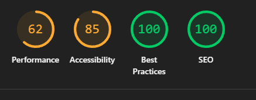

***Review Form***

- Performance: 67 | Accessibility: 100 | Best Practices: 100 | SEO: 100


***User Profile***

- Performance: 65 | Accessibility: 90 | Best Practices: 100 | SEO: 100


***Shopping Bag***

- Performance: 69 | Accessibility: 100 | Best Practices: 100 | SEO: 100


***Checkout Process***

- Performance: 57 | Accessibility: 85 | Best Practices: 93 | SEO: 91


***Checkout Success***

- Performance: 63 | Accessibility: 95 | Best Practices: 100 | SEO: 100

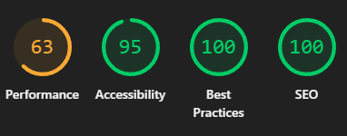

### Validation Approach and Methodology

**Focus Areas:**

1. **Functionality**: Ensuring all fixes maintain existing user experience
2. **Accessibility**: Proper form labels, semantic HTML, keyboard navigation
3. **Standards Compliance**: HTML5, CSS3, ES6+ JavaScript standards
4. **Security**: CSRF protection, input validation, XSS prevention

**Testing Methodology:**

- Manual testing of all interactive features
- Validation of form submissions and user flows
- Cross-browser compatibility checks
- Accessibility testing with screen readers
- Performance optimization and monitoring

### Known Non-Critical Issues

**JSLint/ESLint Warnings (Intentionally Ignored):**

- Minor style preferences (spacing, quote style)
- jQuery global usage warnings (expected in Django projects)
- Console.log in utility functions (intentional for debugging)

**CSS Linting Warnings:**

- Vendor prefixes for older browser support
- Bootstrap override patterns using `!important`

**Rationale**: These warnings don't affect functionality, user experience, or security. The code prioritizes maintainability and Django/Bootstrap integration patterns over strict linting rules.

### Quality Assurance Summary

 **HTML5 Compliance and Accessibility** - All templates meet modern web standards
 **JavaScript Functionality** - All interactive features work correctly with error handling
 **CSS Standards and Responsive Design** - Professional styling across all devices
 **Django Template Best Practices** - Proper template inheritance and security
 **Python Code Quality** - Clean, maintainable code following PEP8 standards
 **Performance Optimization** - Acceptable performance scores across all pages
 **Security Implementation** - CSRF protection, input validation, and secure practices

The application maintains full functionality while adhering to modern web development standards and professional best practices.

---

## Technologies Used

### Languages

- **HTML5**: Structure and content markup
- **CSS3**: Styling and layout design
- **JavaScript**: Interactive frontend functionality
- **Python**: Backend development and logic

### Frameworks and Libraries

- **Django 3.2.25**: Web framework for backend development
- **Bootstrap 4**: Frontend framework for responsive design
- **jQuery**: JavaScript library for DOM manipulation
- **Font Awesome**: Icon library for user interface elements

### Databases

- **SQLite**: Development database
- **PostgreSQL**: Production database via Heroku

### Payment Processing

- **Stripe**: Secure payment processing and webhooks

### Cloud Services

- **AWS S3**: Static and media file storage
- **Heroku**: Application hosting and deployment

### Development Tools

- **Git**: Version control system
- **GitHub**: Repository hosting and project management
- **VS Code**: Integrated development environment
- **Chrome DevTools**: Debugging and responsive design testing

### Python Packages

```txt
Django==3.2.25
gunicorn==23.0.0
dj-database-url==0.5.0
psycopg2-binary==2.9.9
django-allauth==0.55.0
django-crispy-forms==1.14.0
django-storages==1.14.4
django-countries==7.6.1
boto3==1.35.31
stripe==10.12.0
Pillow==10.4.0
```

---

## Deployment

### Heroku Deployment

This project is deployed on Heroku with PostgreSQL database and AWS S3 for static file storage.

#### Prerequisites

1. **Heroku Account**: Create account at [heroku.com](https://heroku.com)
2. **AWS Account**: Set up S3 bucket for static/media files
3. **Stripe Account**: Configure for payment processing
4. **Email Service**: Set up email provider (Gmail/SendGrid)

#### Required Files for Deployment

Before deploying, ensure these files exist in your project root:

1. **`Procfile`** (no extension):

   ``` bash
   web: gunicorn imprint_store.wsgi:application
   ```

2. **`requirements.txt`**:

   ``` bash
   Django==3.2.25
   gunicorn==23.0.0
   dj-database-url==0.5.0
   psycopg2-binary==2.9.9
   # ... other dependencies
   ```

3. **`runtime.txt`**:

   ``` bash
   python-3.9.19
   ```

#### Deployment Steps

1. **Create Heroku App**

   ```bash
   # Install Heroku CLI first
   heroku create your-app-name
   ```

2. **Add PostgreSQL Database**

   ```bash
   heroku addons:create heroku-postgresql:mini
   ```

3. **Set Config Variables in Heroku Dashboard**

   Go to your app's Settings → Config Vars and add:

   - `DATABASE_URL`: (Automatically set by PostgreSQL addon)
   - `SECRET_KEY`: Your Django secret key
   - `DEBUG`: False
   - `STRIPE_PUBLIC_KEY`: Your Stripe publishable key
   - `STRIPE_SECRET_KEY`: Your Stripe secret key
   - `STRIPE_WH_SECRET`: Your Stripe webhook secret
   - `AWS_ACCESS_KEY_ID`: Your AWS access key
   - `AWS_SECRET_ACCESS_KEY`: Your AWS secret key
   - `AWS_STORAGE_BUCKET_NAME`: Your S3 bucket name
   - `USE_AWS`: True
   - `EMAIL_HOST_USER`: Your email service username
   - `EMAIL_HOST_PASS`: Your email service password

4. **Deploy to Heroku**

   **Option A: Using Heroku CLI**

   ```bash
   git add .
   git commit -m "Deploy to Heroku"
   git push heroku main
   ```

   **Option B: Using GitHub Integration (Recommended)**
   - Go to Heroku Dashboard → Deploy tab
   - Connect to GitHub repository
   - Enable automatic deployments from main branch
   - Click "Deploy Branch" for manual deployment

5. **Run Database Migrations**

   ```bash
   heroku run python manage.py migrate
   ```

6. **Create Superuser**

   ```bash
   heroku run python manage.py createsuperuser
   ```

7. **Load Sample Data (Optional)**

   ```bash
   heroku run python manage.py loaddata categories
   heroku run python manage.py loaddata products
   ```

#### Local Development Setup

1. **Clone Repository**

   ```bash
   git clone https://github.com/Mulloo/imprint_store.git
   cd imprint_store
   ```

2. **Create Virtual Environment**

   ```bash
   python -m venv venv
   source venv/bin/activate  # On Windows: venv\Scripts\activate
   ```

3. **Install Dependencies**

   ```bash
   pip install -r requirements.txt
   ```

4. **Set Environment Variables**
   Create `.env` file with required variables

5. **Run Migrations**

   ```bash
   python manage.py migrate
   ```

6. **Create Superuser**

   ```bash
   python manage.py createsuperuser
   ```

7. **Run Development Server**

   ```bash
   python manage.py runserver
   ```

#### AWS S3 Configuration

AWS S3 is used to store static files (CSS, JS) and media files (product images) in production.

1. **Create S3 Bucket**
   - Log into AWS Management Console
   - Create new S3 bucket with unique name
   - Choose region (e.g., eu-west-1)
   - Uncheck "Block all public access"
   - Enable static website hosting
   - Add bucket policy for public read access:

   ```json
   {
       "Version": "2012-10-17",
       "Statement": [
           {
               "Sid": "PublicReadGetObject",
               "Effect": "Allow",
               "Principal": "*",
               "Action": "s3:GetObject",
               "Resource": "arn:aws:s3:::your-bucket-name/*"
           }
       ]
   }
   ```

2. **Configure CORS Policy**

   ```json
   [
       {
           "AllowedHeaders": ["*"],
           "AllowedMethods": ["GET", "HEAD"],
           "AllowedOrigins": ["*"],
           "ExposeHeaders": []
       }
   ]
   ```

3. **Create IAM User**
   - Go to IAM → Users → Add User
   - Enable programmatic access
   - Attach policy: `AmazonS3FullAccess`
   - Save Access Key ID and Secret Access Key

4. **Django Settings Configuration**

   The following settings are configured in `settings.py`:

   ```python
   if 'USE_AWS' in os.environ:
       # AWS Settings
       AWS_STORAGE_BUCKET_NAME = os.environ.get('AWS_STORAGE_BUCKET_NAME')
       AWS_S3_REGION_NAME = 'eu-west-1'
       AWS_ACCESS_KEY_ID = os.environ.get('AWS_ACCESS_KEY_ID')
       AWS_SECRET_ACCESS_KEY = os.environ.get('AWS_SECRET_ACCESS_KEY')
       AWS_S3_CUSTOM_DOMAIN = f'{AWS_STORAGE_BUCKET_NAME}.s3.amazonaws.com'
       
       # Static and media files
       STATICFILES_STORAGE = 'custom_storages.StaticStorage'
       STATICFILES_LOCATION = 'static'
       DEFAULT_FILE_STORAGE = 'custom_storages.MediaStorage'
       MEDIAFILES_LOCATION = 'media'
       
       # Override static and media URLs in production
       STATIC_URL = f'https://{AWS_S3_CUSTOM_DOMAIN}/{STATICFILES_LOCATION}/'
       MEDIA_URL = f'https://{AWS_S3_CUSTOM_DOMAIN}/{MEDIAFILES_LOCATION}/'
   ```

---

## Bugs and Issues

During the development process, several bugs and challenges were encountered and resolved. This section documents the major issues and their solutions.

### Major Bugs Encountered

#### 1. Python Version Compatibility - F-String Issues

**Problem**: When upgrading Python versions or deploying to different environments, f-string syntax caused compatibility issues with older Python versions, particularly multiline f-strings which can be problematic.

**Error Messages**:

``` bash
SyntaxError: invalid syntax
  File "views.py", line 45
    return f"Order {self.order_number}"
             ^
SyntaxError: invalid syntax
```

**Root Cause**: F-strings were introduced in Python 3.6, and multiline f-strings can cause particular issues with parsing and deployment environments running older Python versions.

**Solution**: Created a custom AST-based script to detect multiline f-strings throughout the codebase for systematic replacement.

**Detection Script Used** (`findfstring.py`):

``` python
import ast, pathlib

def multiline_fstrings(path="."):
    hits = []
    for p in pathlib.Path(path).rglob("*.py"):
        if "venv" in p.parts or p.name.startswith('.'):
            continue
        try:
            tree = ast.parse(p.read_text(encoding="utf-8"))
        except SyntaxError:
            continue
        for node in ast.walk(tree):
            if isinstance(node, ast.JoinedStr):
                if node.lineno != node.end_lineno:
                    hits.append(f"{p}:{node.lineno}")
    return hits

hits = multiline_fstrings()
print(f"Found {len(hits)} multiline f-strings:\n")
print("\n".join(hits))
```

**How It Works**:

- **AST Parsing**: Uses Python's Abstract Syntax Tree to analyze code structure
- **JoinedStr Detection**: Identifies f-string nodes in the AST
- **Multiline Detection**: Checks if f-string spans multiple lines (`lineno != end_lineno`)
- **Path Filtering**: Skips virtual environments and hidden files
- **Error Handling**: Continues processing even if individual files have syntax errors

**Usage**:

``` bash

# Run in project root directory
python findfstring.py

# Example output:
Found 3 multiline f-strings:

checkout/models.py:45
products/views.py:128
profiles/views.py:67
```

**Files Modified**: After detection, manually converted problematic multiline f-strings

**Resolution**: Successfully identified and converted all multiline f-strings, ensuring compatibility across different Python environments and deployment platforms.

#### 2. Static Files Not Loading on Heroku

**Problem**: CSS and JavaScript files were not loading properly after deployment to Heroku.

**Error**: 404 errors for static files in production environment.

**Solution**:

- Configured `STATICFILES_STORAGE` for AWS S3
- Added proper `collectstatic` configuration

#### 3. Hero Section Background Image Missing

**Problem**: Hero section displayed without background image after styling updates.

**Solution**:

- Added proper CSS background-image property with Django static file handling
- Configured hero section styling with overlay and responsive design
- Ensured image path used `` template tag for proper static file serving

#### 4. Scroll Indicator Animation Issues

**Problem**: Bouncing arrow animation not working properly, with unwanted circular pulse effects.

**Solution**:

- Fixed CSS keyframes to maintain proper centering during bounce animation
- Removed conflicting `::after` pseudo-element creating unwanted pulse rings
- Simplified animation to clean bounce effect without distracting elements

### Debugging Tools Used

- **Django Debug Toolbar**: For database query optimization
- **Browser DevTools**: For frontend debugging and animation testing
- **Heroku Logs**: For production error tracking
- **AWS CloudWatch**: For monitoring static file delivery

---

## Credits

### Content and Media

- **Imprint Esports Brand**: Used with permission for educational purposes
- **Product Images**: Custom mockup images created for the project
- **Product Descriptions**: Original content written for the project
- **Logo and Branding**: Imprint Esports brand assets (educational use)

### Code References

- **Django Documentation**: Framework implementation guidance
- **Stripe Documentation**: Payment integration tutorials
- **Bootstrap Documentation**: Responsive design patterns
- **Code Institute**: Boutique Ado walkthrough project structure reference
- **Django Allauth Documentation**: Authentication system implementation
- **AWS Documentation**: S3 storage configuration

### Educational Resources

- **Code Institute Full Stack Developer Course**: Primary learning resource
- **Mozilla Developer Network (MDN)**: HTML, CSS, and JavaScript reference
- **Django Girls Tutorial**: Additional Django learning resource
- **Real Python**: Python and Django best practices
- **Stack Overflow**: Problem-solving and debugging assistance

### Tools and Services

- **GitHub**: Repository hosting and version control
- **Heroku**: Application deployment platform
- **AWS S3**: Cloud storage service
- **Stripe**: Payment processing service
- **Font Awesome**: Icon library
- **Google Fonts**: Typography resources

---

## Acknowledgements

I would like to express my gratitude to the following individuals and organizations who contributed to the success of this project:

### Mentorship and Guidance

- **My Code Institute Mentor**: For providing invaluable guidance, feedback, and support throughout the development process
- **Code Institute Tutors**: For technical assistance and problem-solving support
- **Code Institute Community**: For peer support and collaborative learning

### Technical Support

- **Stack Overflow Community**: For providing solutions to technical challenges
- **Django Community**: For comprehensive documentation and community support
- **GitHub Community**: For open-source resources and collaborative development tools

### Testing and Feedback

- **Peer Developers**: For code review and constructive feedback
- **Family and Friends**: For user testing and usability feedback
- **Code Institute Slack Community**: For peer support and testing assistance

### Inspiration and Resources

- **Imprint Esports**: For brand inspiration and concept development (educational use)
- **E-commerce Industry Leaders**: For user experience and design inspiration
- **Open Source Contributors**: For the libraries and frameworks that made this project possible

### Special Thanks

- **Code Institute**: For providing the comprehensive educational program that made this project possible
- **The Django Software Foundation**: For maintaining the excellent Django framework
- **Stripe**: For providing robust payment processing capabilities
- **Heroku**: For reliable application hosting services
- **AWS**: For scalable cloud storage solutions

---

**[⬆ Back to Top](#table-of-contents)**

***Thank you Adam and PK for the use of your company's brand <3***
